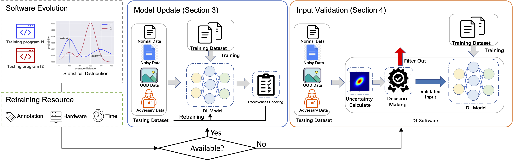

# Uncertainty Awareness of LLMs in Code Analysis
Uncertainty Awareness of Large Language Models Under Code Distribution Shifts: A Benchmark Study

A PyTorch implementation of two code analysis tasks, code summarization~(CS) and code completion~(CC) with four models. We use Python extractors to preprocess the raw code snippets. Users may further extend the work to other programming languages following our study.

<p align="center">
  
</p>

Our study overview:
<p align="center">
  
</p>

Code analysis mechanism:
<p align="center">
  
</p>

## Requirements
- [python3.7+](https://www.python.org/downloads/release/python-380/)
- [PyTorch 1.13.0](https://pytorch.org/get-started/locally/)
- Libraries and dependencies:
```
pip install -r requirements.txt
```

## Quickstart
### Step 0: Cloning this repository
```
git clone https://github.com/yul091/UncertaintyPL.git
cd UncertaintyPL
```
### Step 1: Download our preprocessed [datasets](https://drive.google.com/file/d/1wMH6VrnkzIRMUQCGpcj--bgLTYane6zu/view?usp=sharing)

### Step 2: Fine-tuning a model
To train a model from scratch:
- Code summarization:
```
python -B -m program_tasks.code_summary.main \
  --tk_path ${TK_PATH} --epochs ${EPOCHS} --batch ${BATCH} --lr ${LR} \
  --embed_dim ${EMBEDDING_DIM} --embed_path ${EMBEDDING_PATH} \
  --model_type ${MODEL_TYPE} \
  --train_data ${TRAIN_DATA} \
  --val_data ${VAL_DATA} \
  --test_data ${TEST_DATA} \
  --max_size ${MAX_SIZE} \
  --ensemble_models 5 \
  --do_train --do_eval \
  --embed_type ${EMBEDDING_TYPE} \
  --experiment_name ${EXPERIMENT_NAME} \
  --res_dir ${RES_DIR} | tee $EXPERIMENT_LOG
```
- Code completion:
```
python -B -m program_tasks.code_completion.main \
  --train_data $TRAIN_DATA --val_data $VAL_DATA --test_data $TEST_DATA \
  --model_type $MODEL_TYPE \
  --ensemble_models 5 \
  --embedding_path $EMBEDDING_PATH \
  --embedding_type $EMBEDDING_TYPE \
  --embedding_dim $EMBEDDING_DIM \
  --do_train --do_eval \
  --epochs $EPOCHS --batch_size $BATCH --lr $LR --res_dir $RES_DIR \
  --experiment_name $EXPERIMENT_NAME | tee $EXPERIMENT_LOG
```
### Step 3: Calibrating the model and quantifying the uncertainty scores
```
python test_uncertainty.py \
  --module_id $MODULE_ID --res_dir $RES_DIR \
  --data_dir $DATA_DIR --save_dir $SAVE_DIR \
  --train_batch_size $TRAIN_BATCH_SIZE \
  --test_batch_size $TEST_BATCH_SIZE \
  --ensemble_dirs $ENSEMBLE_DIRS \
  --max_size $MAX_SIZE | tee $EXPERIMENT_LOG
```
### Step 4: Evaluation the effectiveness of different UE techniques:
- Misclassification detection:
```
python -B -m Uncertainty_Eval.evaluation \
  --shift_type $SHIFT \
  --task $TASK \
  --model $MODEL | tee $EXPERIMENT_LOG
```
- Selective prediction:
```
python input_validation.py \
  --shift_type $SHIFT \
  --task $TASK \
  --model $MODEL \
  --uncertainty_dir $METRICDIR \
  --out_dir $OUTDIR \
  --strategy coverage
```
- OOD detection:
```
python -B -m Uncertainty_Eval.evaluation \
  --shift_type $SHIFT \
  --task $TASK \
  --ood \
  --model $MODEL | tee $EXPERIMENT_LOG
```